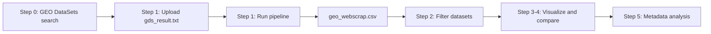

# GEOScouter documentation

> ### Deployed app
>
> - **Entry point:** [`streamlit_app.py`](../streamlit_app.py)
> - **Branch:** `dev` (Streamlit Community Cloud)
> - **Example input:** [`data/input/gds_result.txt`](../data/input/gds_result.txt)

GEOScouter helps you profile and compare public datasets on [GEO](https://www.ncbi.nlm.nih.gov/geo/) from an exported `gds_result.txt` search.

**Code is the source of truth.** Paths, cache file names, and runtime behavior live in the scripts and package modules linked below — not duplicated here.

---

## Getting the input (start here)

Before using the app, run a search on [GEO DataSets](https://www.ncbi.nlm.nih.gov/gds/) and export **`gds_result.txt`**.

See [pipeline/01_gds_input.md](pipeline/01_gds_input.md) for how that file is structured and what GEOScouter reads from it.

---

## Pipeline overview



| Stage | What happens |
|-------|--------------|
| Step 0 | Search GEO DataSets; export `gds_result.txt`. |
| Step 1 | Upload file → **Run pipeline** → scrape GEO → write `geo_webscrap.csv` (cached under `/tmp/geoscouter/`). |
| Step 2 | Filter by assay type, platform, sample count; optional GSM metadata fetch and filters. |
| Step 3 | Snapshot plots, file-per-sample complexity, supplementary-file similarity networks. |
| Step 4 | Build a GSE comparison list; export filtered CSV. |
| Step 5 | Explore and export GSM-level metadata tables (optional). |

---

## Quick start

### Local

```bash
cd path/to/GEOScouter
git checkout dev
python3 -m venv .venv
source .venv/bin/activate
pip install -r requirements.txt
streamlit run streamlit_app.py
```

Open the URL Streamlit prints (usually http://localhost:8501).

### Streamlit Community Cloud

1. Push the `dev` branch to GitHub.
2. [share.streamlit.io](https://share.streamlit.io) → New app → repo `Mmaycon/GEOScouter`, branch **`dev`**, main file **`streamlit_app.py`**.
3. After deploy or code updates: use **Delete all cached outputs** in the app, then re-run the pipeline.

### Using the app (short)

1. Upload `gds_result.txt` → **Run pipeline**
2. **Apply scrape-level filters** (step 2)
3. **Visualize datasets** (step 3) — define a supervised file-structure signature (training GSEs or manual file types)
4. Optionally fetch sample metadata and export Excel (steps 2 and 5)

---

## Doc map

| Topic | Doc | Source code |
|-------|-----|-------------|
| Pipeline overview | [pipeline/README.md](pipeline/README.md) | — |
| Step 0 — `gds_result.txt` input | [pipeline/01_gds_input.md](pipeline/01_gds_input.md) | [geoscouter/core/gds_parse.py](../geoscouter/core/gds_parse.py) |
| Step 1 — web scraping | [pipeline/02_web_scraping.md](pipeline/02_web_scraping.md) | [geoscouter/core/pipeline.py](../geoscouter/core/pipeline.py), [tar_expand.py](../geoscouter/core/tar_expand.py) |
| Step 2 — filtering | [filtering/README.md](filtering/README.md) | [filters.py](../geoscouter/core/filters.py), [platforms.py](../geoscouter/core/platforms.py), [metadata.py](../geoscouter/core/metadata.py) |
| Steps 3–4 — visualization | [visualization/README.md](visualization/README.md) | [viz/](../geoscouter/viz/), [similarity.py](../geoscouter/core/similarity.py) |
| Series Matrix files (design note) | [reference/series_matrix_files.md](reference/series_matrix_files.md) | — |
| GEO DataSets vs GEOScouter | [reference/geodatasets_api_vs_geoscouter.md](reference/geodatasets_api_vs_geoscouter.md) | — |

---

## Related docs (outside `doc/`)

| Doc | Role |
|-----|------|
| [README.md](../README.md) | Install, deploy, sync with GitHub |
| [legacy/app/](../legacy/app/) | Previous monolithic Streamlit scripts (reference only) |
| [geoscouter/config.py](../geoscouter/config.py) | `WORK_DIR`, `CACHE_FILES`, input filename |

---

## Versioning

| Component | Current | Notes |
|-----------|---------|-------|
| Deploy branch | `dev` | Streamlit Cloud points here |
| UI entry | `streamlit_app.py` | Steps 1–5 in one app |
| Scrape pipeline | `geoscouter/core/pipeline.py` | SOFT full-view URL; XML for `*_RAW.tar`; optional Selenium fallback |
| Tar expansion | `geoscouter/core/tar_expand.py` | Remote tar member listing for supplementary filenames |
| Working directory | `/tmp/geoscouter/` | Defined in `geoscouter/config.py` |
