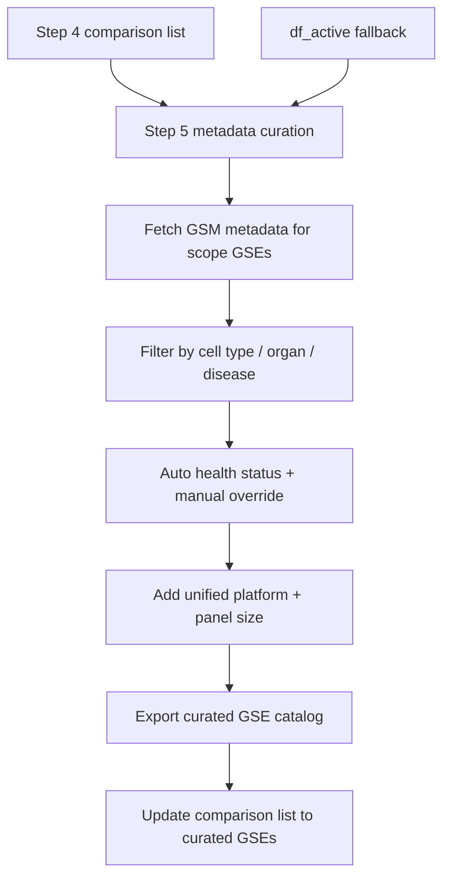

# Sample metadata curation — step 5

Fetch GSM-level metadata, filter by cell type / organ / disease, classify health status, and export a curated GSE catalog.

**Source:** [streamlit_app.py](../../streamlit_app.py) (section 5), [curation.py](../../geoscouter/core/curation.py), [filters.py](../../geoscouter/core/filters.py), [metadata.py](../../geoscouter/core/metadata.py)

---

## Workflow

---

## Fetch scope

When you click **Fetch GEO sample metadata**, GEOScouter downloads SOFT via GEOparse for:

1. **Comparison list GSEs** (step 4) when the list is non-empty
2. Otherwise, all GSEs in the **active working set** (`df_active`)

Output: list of per-GSE DataFrames in session (`list_of_metadata_dfs`), cached under `/tmp/geoscouter/metadata/geo_soft_files/`.

This step can take several minutes for large lists. A new fetch clears manual health overrides.

---

## Sample metadata filtering

Grouped multiselects map common GEO field aliases:

| Group | Aliased fields |
|-------|----------------|
| Cell type | `cell type`, `cell_type`, `celltype` |
| Organ / tissue | `tissue`, `organ`, `organism part`, `source_name_ch1`, … |
| Disease | `disease`, `disease state`, `diagnosis`, `condition` |

**Apply metadata filters** sets `metadata_matched_gses` and filters the curated catalog display. It does **not** shrink the step 2 working set.

An expander provides advanced per-field filters for non-standard GEO keys (`METADATA_FILTER_FIELDS` in filters.py).

---

## Health status curation

Each GSE receives an auto-classified health status from series title + GSM metadata text:

| Status | Example keywords |
|--------|------------------|
| `cancer` | cancer, carcinoma, tumor, malignant, metastatic, … |
| `healthy` | healthy, normal, control, non-tumor, benign, … |
| `other` | everything else |

Priority: **cancer > healthy > other**.

You can override per GSE in the curated table editor. Overrides are stored in `gse_health_overrides` and reflected in the `Health_status_source` column (`auto` or `manual`).

Filter chips show only healthy / cancer / other rows.

---

## Curated GSE catalog

`build_curated_gse_table()` produces one row per GSE:

| Column | Description |
|--------|-------------|
| `GSE` | Series ID |
| `GEO link` | Link to GEO series page |
| `Title` | Series title from scrape |
| `Unified_platform` | Short label (Xenium, CosMx, Visium, …) |
| `Platform_title` | Full GPL title |
| `Panel_size` | Best-effort parse from metadata / title |
| `num_samples` | Sample count |
| `Health_status` | `healthy`, `cancer`, or `other` |
| `Health_status_source` | `auto` or `manual` |
| `Matching_samples` | GSM count after metadata filters |
| `Cell_types_found` | Aggregated cell-type values |
| `Organs_found` | Aggregated organ/tissue values |
| `Diseases_found` | Aggregated disease values |

---

## Exports and comparison list

| Action | Output |
|--------|--------|
| **Export curated catalog** | `curated_gse_catalog.csv` (also available from step 4 when catalog exists) |
| **Update comparison list** | Replaces `gse_selection_list` with curated GSEs (respecting metadata + health filters) |
| **Export all metadata to Excel** | `metadata_GSE.xlsx` (expander) |
| **Keyword search export** | `metadata_filtered_by_word.xlsx` (expander) |

Run step 5 before final export when you need cell/organ/disease filtering or health curation.

---

## Session state

| Key | Meaning |
|-----|---------|
| `list_of_metadata_dfs` | Fetched GSM tables |
| `metadata_fetch_scope_gses` | GSEs last fetched |
| `metadata_filter_groups` | Selected group filter values |
| `metadata_matched_gses` | GSEs matching metadata filters |
| `gse_health_overrides` | Manual health status per GSE |
| `curated_gse_df` | Last built catalog |

---

## Related

- [filtering/README.md](../filtering/README.md) — step 2 scrape-level filters
- [visualization/README.md](../visualization/README.md) — step 4 comparison list
