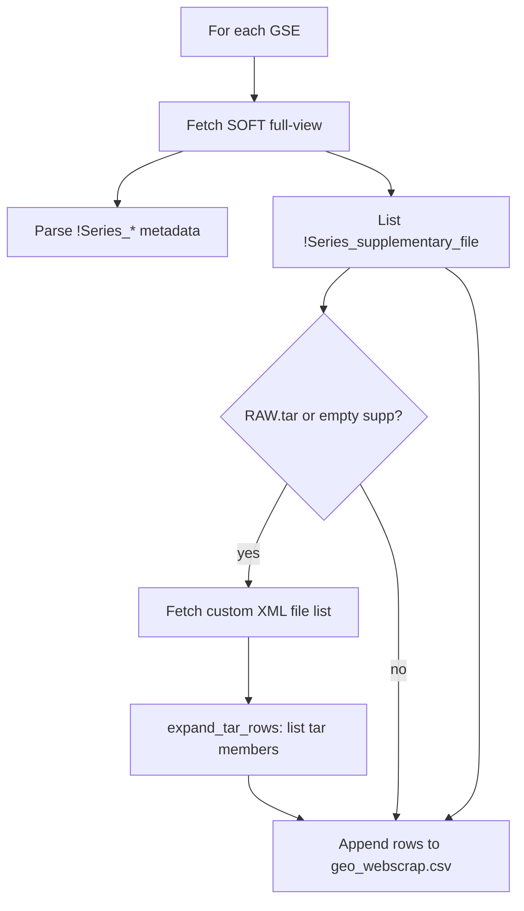

# Step 1 — Web scraping

For each GSE in `gds_processed.csv`, GEOScouter fetches series metadata and supplementary file names, then writes **`geo_webscrap.csv`**.

**Source:** [geoscouter/core/pipeline.py](../../geoscouter/core/pipeline.py), [tar_expand.py](../../geoscouter/core/tar_expand.py)

---

## When to use

- After uploading `gds_result.txt`, click **Run pipeline** in the app.
- Re-run only when the cache is cleared or the GSE list changes.

---

## High-level flow



---

## Data sources (per GSE)

### 1. SOFT full-view (primary)

URL pattern:

```
https://www.ncbi.nlm.nih.gov/geo/query/acc.cgi?acc={GSE}&targ=self&form=text&view=full
```

Provides:

- Series metadata (`!Series_title`, `!Series_summary`, contact fields, etc.)
- Platform and sample IDs (`GPL*`, `GSM*`)
- Series-level supplementary file FTP URLs

Implemented in `_fetch_soft_text()` and `_parse_metadata_from_soft()`.

**Note:** Older code paths used HTML table scraping and `&format=soft`. NCBI may return reCAPTCHA for those URLs; the full-view endpoint is the supported approach.

### 2. Custom XML download (`*_RAW.tar`)

When SOFT lists only a bundled archive (e.g. `GSE291687_RAW.tar`) or no series supplementary files:

```
https://www.ncbi.nlm.nih.gov/geo/download/?format=xml&acc={GSE}
```

Returns per-file names and sizes → `fetch_custom_supp_files_xml()`.

### 3. Remote tar expansion

For remaining `.tar` / `.tar.gz` / `.tgz` entries, [expand_tar_rows](../../geoscouter/core/tar_expand.py) streams the archive over HTTPS and lists inner member filenames. The archive name itself is replaced by one row per inner file.

Limits (defaults): 5000 members, 2 GB scanned — see `tar_expand.py`.

### 4. HTML / Selenium (fallback)

If HTML is not blocked, supplementary tables and `(custom)` links are tried. Selenium is optional and mainly for local runs when HTTP custom pages fail.

---

## Row model

- **One row per supplementary file**, with series metadata repeated on each row.
- If no supplementary files are found, **one row** with metadata only.
- `File type/resource` is set to the full filename (dev branch) for similarity matching.

---

## Outputs

| File | Description |
|------|-------------|
| `gds_processed.csv` | GSE + cluster (+ `Study_type`) |
| `geo_webscrap.csv` | Combined scrape table |

After pipeline run, `ensure_platform_labels()` adds/refines `Platform_labels` using GPL browser titles when possible.

---

## Troubleshooting

| Symptom | Likely cause | Fix |
|---------|--------------|-----|
| Only 4 columns (`Platforms`, `Samples`, `Series`, `SuperSeries`) | Stale cache from broken scrape | **Delete all cached outputs**; re-run pipeline |
| Missing Title/Summary after deploy | Old code on server or cache | Confirm `dev` deploy; clear cache |
| Only `GSE*_RAW.tar` in CSV | XML/tar expansion failed | Check logs; verify GSE has public custom file list |
| Slow pipeline | Many GSEs + tar expansion | Expected for large searches; reduce GSE list in DataSets export |

---

## Related

- [pipeline/README.md](README.md) — output columns and cache
- [reference/series_matrix_files.md](../reference/series_matrix_files.md) — why Series Matrix files are not the default source
