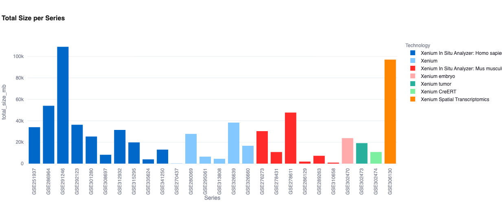
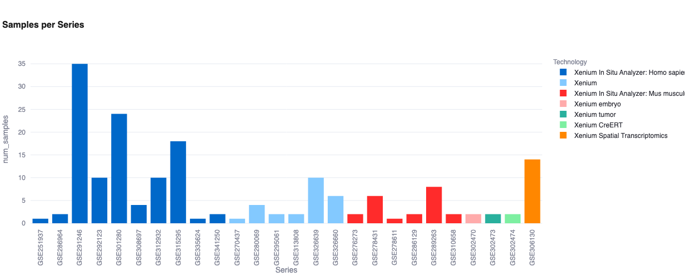
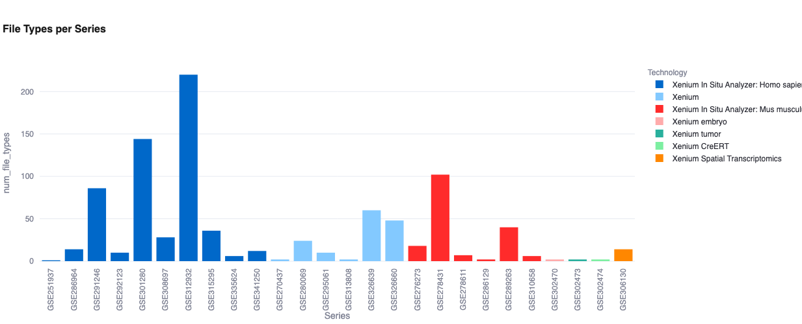
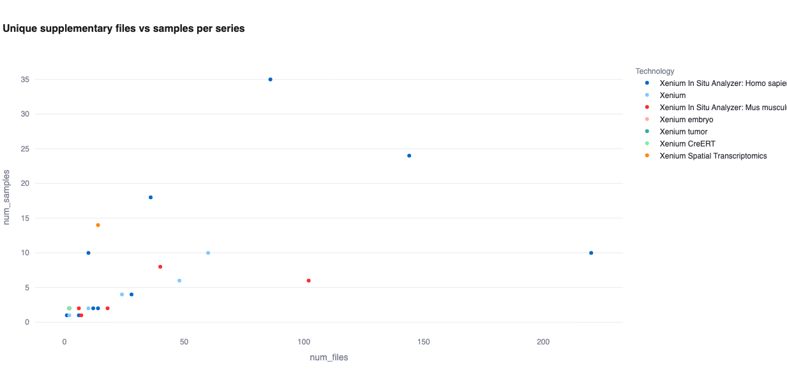
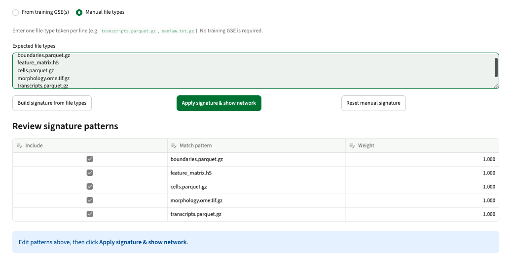
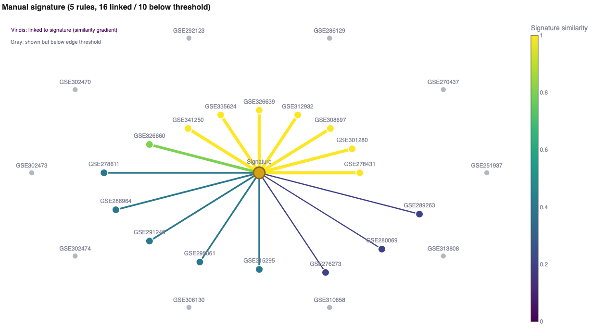
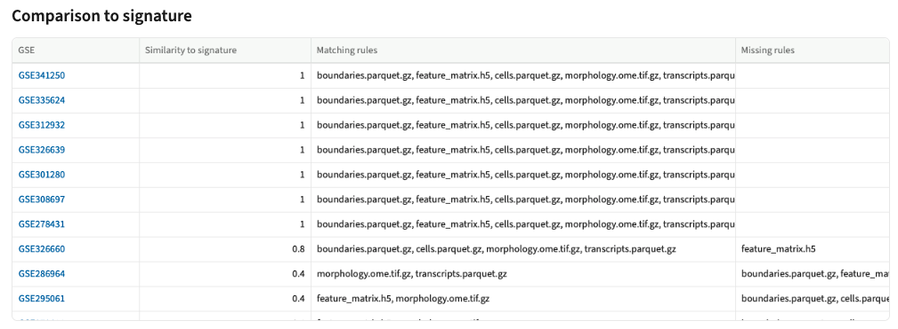
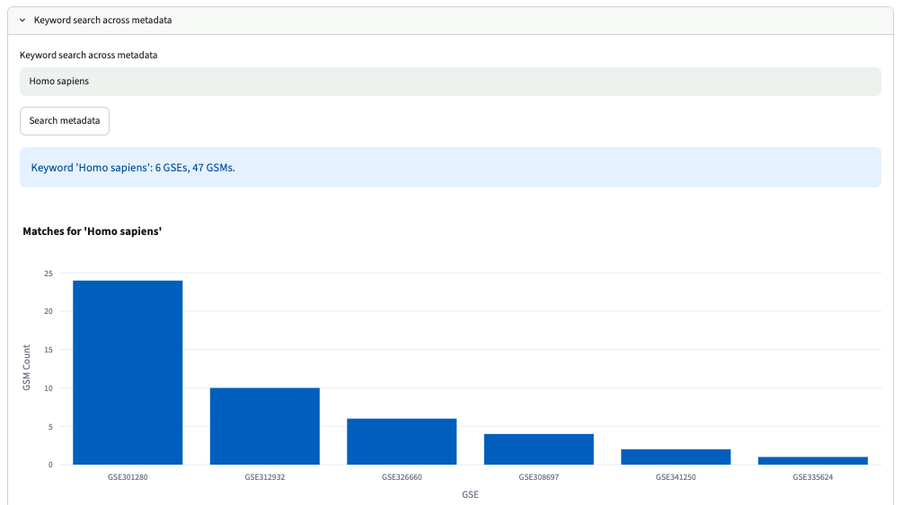

# Worked Example: End-to-End GEOScouter Run

This guide provides a reproducible end-to-end workflow to test GEOScouter using a fixed input and expected outputs.  

### Pinned Parameters

| Parameter | Value |
|-----------|-------|
| **Input file** | [`gds_result_skin_xenium.txt`](files/input/gds_result_skin_xenium.txt) |
| **Step 2 - Platform (GPL)** | `GPL33762` (Xenium Homo sapiens) AND `GPL33896` (Xenium Mus musculus) |
| **Step 3 - Signature Tokens** | `boundaries.parquet.gz`, `feature_matrix.h5`, `cells.parquet.gz`, `morphology.ome.tif.gz`, `transcripts.parquet.gz` |
| **Step 4 - Similarity Threshold** | `0.80` |
| **Step 5 - Keyword Search** | `Homo sapiens` |

---

## Step 1 — Run data scraping

1. Go to Step 1 and upload the example search result file: [`gds_result_skin_xenium.txt`](files/input/gds_result_skin_xenium.txt). (For instructions on generating this file, see [01_gds_input.md](../pipeline/01_gds_input.md)).
2. Click **Run pipeline**. 
3. The app will scrape GEO for the 29 GSEs found in the input. Once complete, you can download the raw scrape results (e.g., `geo_webscrap.csv`).

## Step 2 — Filter datasets

In this section, you can filter the scraped datasets to ensure you only compare the specific types of data you want. The app provides options to filter by "Assay type", "Platform (GPL)", and to set minimum or maximum limits for the number of samples.

1. Under **Platform (GPL)**, select `Xenium In Situ Analyzer: Homo sapiens (GPL33762)` and `Xenium In Situ Analyzer: Mus musculus (GPL33896)`.
2. Leave the other filter options empty or at their default `0` values.
3. Click **Apply scrape-level filters**. The active working set is now reduced to 26 series.

## Step 3 — Visualize datasets

In this section, you can generate plots to visually profile the filtered datasets. You can click "Generate all visualizations" to load everything at once, or select individual tabs: "Snapshot bars" (for general sizes and counts), "File vs samples" (to compare sample counts against unique files), and "Similarity network" (to build a signature).

### Snapshot bars
* Displays the total size of each GSE:
  
* Displays the number of samples for each GSE:
  
* Displays the number of file types for each GSE:
  

### File vs samples
Compares the sample count against unique supplementary files so we can check if the number of samples is proportional to the number of files.

### Similarity network (Supervised file-structure signature network)
1. Select **Manual file types** as the signature source.
2. Enter the 5 signature tokens listed in the parameters table (one per line).
3. Click **Build signature from file types** to review the match patterns with their weights.
   
4. Click **Apply signature & show network**. Slide the minimum similarity for creating an edge to `0.20`.
   
5. The **Comparison to signature** table details which specific rules matched or missed for each GSE.
   

## Step 4 — Select specific GSEs

Here we select the GSEs we want to keep for the final comparison. You can add datasets in bulk based on a minimal value of signature similarity, or you can manually enter specific GSE IDs if you want to force their inclusion regardless of their score.

1. Slide the **Minimum signature similarity** threshold to `0.80` and click **Add GSEs matching signature (>= threshold)**. This automatically adds datasets that structurally match your signature rules at 80% or higher.
2. To add a dataset manually (for example, a dataset that scored below the threshold but is relevant to your analysis), enter the GSE ID in the text field and click **Add manual GSE**. For this example, no manually added GSEs are used.
3. The comparison list now contains 8 unique GSEs.
4. Click **Export comparison list as filtered table** to download the subset containing basic information of the filtered GSEs.
   * **Export:** [`filtered_geo_webscrap.csv`](files/output/filtered_geo_webscrap.csv)

## Step 5 — Sample metadata filtering and curation

Now we perform sample metadata filtering and curation strictly for the selected GSEs.

1. First, we can filter specific information from the metadata (such as organ/tissue, disease, etc.). In this example, we are applying no filtering and moving to the next part.
2. The curated GSE catalog appears, showing the metadata of each GSE after applying filters.
   * **Export:** [`curated_gse_catalog.csv`](files/output/curated_gse_catalog.csv)
3. Next, we can view the metadata of each GSM separately. You can also search for keywords to find samples that mention a specific word anywhere in their metadata. The app returns the number of GSEs and GSMs containing that keyword.
4. Using `"Homo sapiens"` as an example keyword yields 6 GSEs and 47 GSMs.
   
5. Finally, click **Export all fetched metadata to Excel**. This creates an Excel workbook where each tab is one GSE, containing the metadata of all its samples.
   * **Export:** [`metadata_GSE.xlsx`](files/output/metadata_GSE.xlsx)